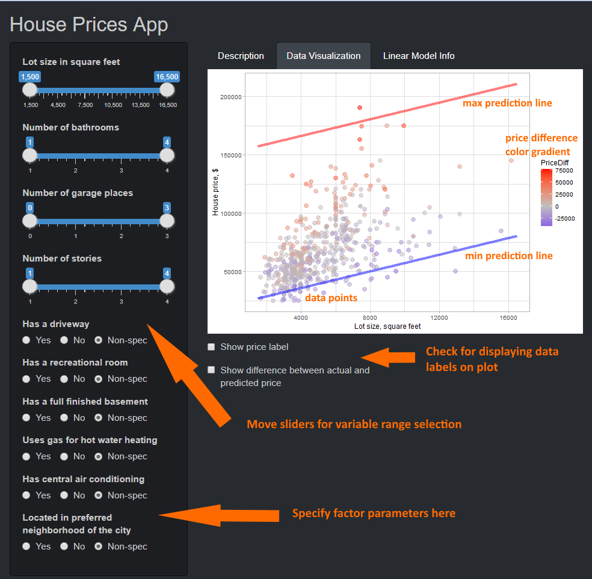

```{r setup, include=FALSE}
knitr::opts_chunk$set(echo = FALSE)
```

## House Prices App Description 

**House Prices** app is based on [HousePrices](https://www.rdocumentation.org/packages/AER/versions/1.2-9/topics/HousePrices) dataset from AER R package. Data represent sales prices of houses sold in the city of Windsor, Canada, during July, August and September, 1987.     

Goal of this app is to help user find suitable house from dataset with multiple variables. User should specify desired house parameters, using Sliders and RadioButtons on App Sidebar, all data points in selected range are displayed on price-lotsize plot.  
App prediction algorithm, based on simple linear model helps in house price estimation. Dot color indicates if house is overestimated (red) or underestimated (blue). There is also ability to display price value and actual-predicted price difference on the plot (it's better to use this tool when just few data points remained). 

Also algorithm produces two prediction lines - for minimum and maximum parameters from selected ranges.
If there are no houses with specified parameters, lines should help to estimate predicted price.



## House Prices App User Interface

```{r, message=F, warning=F, echo=T, eval=F, class.source="bg-success"}
# This is the user-interface definition of a Shiny App (file ui.R)
library(shiny)
library(shinythemes)

My_RadioButton<-function(inputId, label) {          #Custom RadioButton creation
    radioButtons(inputId, label, choiceNames=c("Yes", "No", "Non-spec"), 
                 choiceValues=c(0, 1, 2), inline=T, selected=2)}

# Define UI for application
shinyUI(fluidPage(
    theme = shinytheme("slate"), 
    titlePanel("House Prices App"),
    sidebarLayout(
        sidebarPanel(
            sliderInput("binSize", "Lot size in square feet",
                        min = 1500, max = 16500, value = c(1500, 16500), step=100),
            sliderInput("binBathrooms", "Number of bathrooms",
                        min = 1, max = 4, value = c(1,4), step=1),
            sliderInput("binGarage", "Number of garage places",
                        min = 0, max = 3, value = c(0,3), step=1),
            sliderInput("binStories", "Number of stories",
                        min = 1, max = 4, value = c(1,4), step=1),
            My_RadioButton("radioDriveway", "Has a driveway"),
            My_RadioButton("radioRecreat", "Has a recreational room"),
            My_RadioButton("radioBase", "Has a full finished basement"),
            My_RadioButton("radioGasheat", "Uses gas for hot water heating"),
            My_RadioButton("radioAircon", "Has central air conditioning"),
            My_RadioButton("radioPrefer", "Located in preferred neighborhood of the city"),
            ),
        
        mainPanel(                       # Main panel items
            tabsetPanel(type = "tabs",
                        tabPanel("Description", 
                                 h4("This app is based on", tags$a(href="https://www.rdocumentation.org/packages/AER/versions/1.2-9/topics/
                                    HousePrices", "HousePrices"), "dataset from AER R package. Data represent sales prices of houses sold in 
                                    the city of Windsor, Canada, during July, August and September, 1987."),
                                 h4("Find the house of your dreams for the best price!"),
                                 h3("How to use App:"),
                                 h4("1. Go to the Data Visualization Tab."),
                                 h4("2. Select desired ranges for numeric parameters on sliders."),
                                 h4("3. Specify desired factors on RadioButtons, Non-spec selects both cases."),
                                 h4("4. Scatterplot displays selected data points from original dataset. Red and blue lines represent 
                                 predictions for the most upper and the most lower of specified values and factors."),
                                 h4("5. If there are no plotted data points, there are no such houses for sale. Try other parameters,
                                    or you can just estimate price range by prediction lines."),
                                 h4("6. Use checkboxes under the plot to display actual pice and (actual - predicted) price difference. 
                                    Negative difference means, that real price is lower, than predicted."), 
                                 h4("7. Using text labels with many data points makes plot messy. 
                                    You can just evaluate actual-predicted price difference by color. Reds are expensive, blues are cheap."),
                                 h4("You can find some model description on \"Linear Model Info\" tab."),
                                 ),
                        tabPanel("Data Visualization", plotOutput("distPlot"),
                                 checkboxInput("checkShowPrice", "Show price label"),
                                 checkboxInput("checkShowDiffer", "Show difference between actual and predicted price"),
                                 ),
                        tabPanel("Linear Model Info", 
                                 h5("We used simple linear model for house price prediction algorithm. Interception and number of bedrooms 
                                 are excluded from model, due to non-significant variable coefficient p-values (>0.05). All model coefficients 
                                 are positive, that makes finding min and max range prediction lines very straightforward - we just need to 
                                 find set of all min-s and all max-es from variable ranges. App algorithm produces two parallel lines, which are 
                                 price-lotsize estimations for min and max sets of other model parameters in range of min and max lotsize from 
                                 appropriate slidebar. When all the parameters are strictly defined, two lines collapses into single prediction line."),
                                 verbatimTextOutput("Linear_Model"))))
    )
))
```

## House Prices App Server Logic 

```{r, message=F, warning=F, echo=T}
# Server logic of a Shiny web application (file server.R)
library(shiny)
library(AER)
library(dplyr)
library(intrval)
library(ggplot2)
data(HousePrices)
# Text variable yes/no to numeric conversion 
fToN <- function(x) {as.numeric(factor(x, levels = c("no","yes"),ordered=T))-1}
hp<-mutate(HousePrices, driveway=fToN(driveway), recreation=fToN(recreation),
           fullbase=fToN(fullbase), gasheat=fToN(gasheat),
           aircon=fToN(aircon), prefer=fToN(prefer))            
fit_line<-lm(price~.-1-bedrooms, data=hp)      #Fitting model

shinyServer(function(input, output) {          #Define server logic
    #Function for constructing min and max prediction dataframes
    #Xpoint is 1-st or 2-nd of slidebar, Level is min or max
    predicted_Range<-function(Xpoint, Level) {
        LevelVAL<-ifelse(Level=="min", 1, 2)     
        LevelFUN<-ifelse(Level=="min",         #Logic for RadioButtons
                     function(x) as.numeric(x==0), 
                     function(x) as.numeric(x!=1)) 
        data.frame(lotsize=input$binSize[Xpoint], 
               bedrooms=0,                #bedrooms excluded from linear model
               bathrooms=input$binBathrooms[LevelVAL],
               stories=input$binStories[LevelVAL], 
               driveway=LevelFUN(input$radioDriveway),
               recreation=LevelFUN(input$radioRecreat), 
               fullbase=LevelFUN(input$radioBase),
               gasheat=LevelFUN(input$radioGasheat), 
               aircon=LevelFUN(input$radioAircon),
               garage=input$binGarage[LevelVAL], 
               prefer=LevelFUN(input$radioPrefer))    
    }   
    #Plotting data
    output$distPlot <- renderPlot({       
       hp2<-filter(hp,                    #filtering specified data
                    lotsize %[]% input$binSize,
                    bathrooms %[]% input$binBathrooms,
                    stories %[]% input$binStories,
                    garage %[]% input$binGarage,
                    driveway!=input$radioDriveway,
                    recreation!=input$radioRecreat,
                    fullbase!=input$radioBase,
                    gasheat!=input$radioGasheat,
                    aircon!=input$radioAircon,
                    prefer!=input$radioPrefer)
       
        #Constructing dataframes for plotting lines
        Ymin1<-predict(fit_line, newdata=predicted_Range(1, "min"))
        Ymin2<-predict(fit_line, newdata=predicted_Range(2, "min"))
        Ymax1<-predict(fit_line, newdata=predicted_Range(1, "max"))
        Ymax2<-predict(fit_line, newdata=predicted_Range(2, "max"))
        lineMin<-data.frame(x=c(input$binSize[1], input$binSize[2]), 
                            y=c(Ymin1, Ymin2))
        lineMax<-data.frame(x=c(input$binSize[1], input$binSize[2]), 
                            y=c(Ymax1, Ymax2))
        # Calculating difference
        hp2<-mutate(hp2, PriceDiff=price-predict(fit_line, newdata=hp2))
        #Creating and plotting ggplot object
        p<-ggplot(hp2, aes(x=lotsize, y=price, color=PriceDiff))+
            scale_colour_gradient2(low = "blue", mid = "gray", high = "red")
        p<-p+geom_point(size=3, alpha=0.5)+
            labs(x="Lot size, square feet", y="House price, $")+
            theme_light()+
            geom_line(data=lineMin, aes(x=x,y=y), color="blue", lwd=1.5, alpha=0.5)+
            geom_line(data=lineMax, aes(x=x,y=y), color="red", lwd=1.5, alpha=0.5)
            if (input$checkShowPrice) {p<-p+geom_text(aes(lotsize, price, 
                                       label=paste(price, "$")), hjust=0, vjust=1, color="black")}
            if (input$checkShowDiffer) {p<-p+geom_text(aes(lotsize, price, 
                                       label=paste(round(PriceDiff), "$")), hjust=0, vjust=2, color="black")}
        p 
    })
    output$Linear_Model<-renderPrint(summary(fit_line))  #Printing model summary 
})


```

## Linear Model Summary

We used simple linear model for house price prediction algorithm. Interception and number of bedrooms 
are excluded from model, due to non-significant variable coefficient p-values (>0.05). All model coefficients 
are positive, that makes finding min and max range prediction lines very straightforward - we just need to 
find set of all min-s and all max-es from variable ranges. App algorithm produces two parallel lines, which are 
price-lotsize estimations for min and max sets of other model parameters in range of min and max lotsize from appropriate slidebar.
When all the parameters are strictly defined, two lines collapses into single prediction line. 
```{r, echo = T}
summary(fit_line)
```
All model coefficient p-values are significant, let's look at coefficient 95% confidence intervals:

```{r, echo=T}
confint(fit_line)
```

